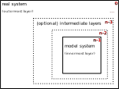
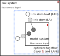
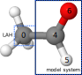

Minimization with Microiterations
*********************************

Pysisyphus allows layered optimizations using  microiterations via the
`LayerOpt` class. Required energies and its derivatives (gradients, Hessians)
can either be calculated with pysisyphus' own ONIOM implementation or supplied
through Unix sockets via the i-PI protocol.

In ONIOM calculations a small (model) system is treated using a high level of theory,
while its surroundings (real system) are described at a lower, more economic level of theory.
There may also be several (optional) intermediate layers. Please see the figure below.

  General structure of a n-layer ONIOM calculation in pysisyphus. Every box corresponds
  to a layer. Indices of the respective layers are given as red numbers in the top right
  corner of each layer.

Searching stationary points of such systems using classical optimization approaches with
simultanous relaxation of model and real system can be computationally quite costly.
In cases where the model system converges before the real system, many unnecessary
model system energy and gradients evaluations may be required to fully relax
the total system, as one step requires gradient evaluations in all layers. Also,
it may be prohibitively expensive to optimize the whole system using internal coordinates,
so it would be desireable to treat only the model system using internal coordinates.

Optimization with microiterations offers a way to potentially reduce the number
of costly calculations in the innermost layer. By fully relaxing the outer layers
before taking a step in the innermost layer, superfluous gradient evaluations can be avoided.
As the overall calculation time of an ONIOM energy/gradient is usually dominated by the
innermost layer, great compuational saving can by realized by decreasing the
required number of such calculations. 

In the present approach, outer layers are optimized in Cartesian coordinates with an
economic optimizer like (preconditioned) limited memory BFGS (L-BFGS) or conjugate
gradient (CG).
As L-BFGS avoids operations with steep scaling costs like matrix diagonalization,
relaxation of large system comprising thousands of atoms becomes possible with
negligible computational overhead.
In contrast to the outer layers, the inner layer is usually optimized using internal
coordinates and an optimizer that utilizes an explicit Hessian matrix, as this often
allows for the most efficient optimizations.

As energy and gradient evaluations in the outer layers should be cheap
the inferior performance of optimizations in Cartesian coordinates should not lead
to an overall runtime increase.

YAML input
----------

When pysisyphus' native ONIOM calculator is to be used, appropriate input has to be
given in the ``calc:`` section, that is, layer composition and the respective calculators.
If energies & gradients are sent via sockets and the i-PI-protocol ``calc:`` can be
left empty but the appropriate socket addresses have to specified later in the ``opt:``
section (see below). A separate socket/address is required for each layer.

Independent of the actual layer, pysisyphus always expects vectorial quantities with
appropriate shapes of the total system. The expected size of a force vector for a
system comprising ``N`` atoms is ``3N``. Vector components not belonging to frozen
atoms not belonging to a given layer are ignored and may be zero. **It is expected,
that the full valid ONIOM forces for the total system are sent with the innermost layer**.
These forces are then also used to check for optimization convergence.

A layered optimization is requested via ``type: layer`` in the ``opt:`` section. If
no further input is given, appropriate defaults will be used.
Micoiterations for the outer layers ``0 to n-2`` will be carried out using Cartesian
coordinates and regularized L-BFGS, while the innermost layer is optimized in internal
coordinates (``type: tric``) using rational function optimization (``type: rfo``).

If a more fine grained control is desired each layer can be controlled independently
by further keywords in the ``layers:`` list.
When ``layers:`` is present in the input all
layers must be specified, but empty list entries are possible (see the lines
only containing a comment in the example below).
**One must start with the outmost layer**; the last list item
corresponds to the innermost layer.
Geometry and/or optimizer setup of each layer is controlled by the ``geom:`` and ``opt:``
sections in the list of layers with the usual keywords.

The usual keywords to control the optimization are supported, e.g., ``max_cycles``,
``thresh`` etc.

.. code:: yaml

   geom:
    type:
     cartesian
    fn: [filename of initial geometry]
   calc:
    type:
     oniom:
      ...
   opt:
    type:
     layer:
      [layers:
        - # dummy for layer 0 (real system)
        - # dummy for layer 1 layer
        - # ...
        # - # dummy for layer n-1 (model system)
        - geom:
           type:
            cartesian:
          opt:
           type:
            lbfgs:
      ]
    # thresh: gau_loose
    # max_cycles: 150

Below you can find a full example for the ONIOM2-optimization of Hexaphenylethane
using pysisyphus' ONIOM implementation.

Example using pysisyphus' ONIOM
-------------------------------

.. literalinclude :: ../examples/opt/21_xtb_layeropt/21_xtb_layeropt.yaml
   :language: yaml

Example with sockets & i-PI-protocol
------------------------------------

Whereas pysisyphus can figure out the layer composition for the microcycles when its own
ONIOM calculator is used, the user has to specify it when using sockets and the i-PI-protocol.
When covalent bonds between layers exist link atoms (LAs) must be introduced. Given a
layer with index ``n``, atoms in layer ``n-1`` that are replaced by LAs in the given layer
are called link atom hosts (LAH). A given layer and its LAHs in **higher** layers must
be optimized together.

  Layer structure of a ONIOM2 optimization using microiterations with link atoms.
  A given layer as well as connected link atom hosts in **higher** layers must be
  optimized simultaneously.

A simple example for a ONIOM2 optimization with microiterations is found below. Here,
ethanal is optimized, with the model system comprising the carbonyl group (atoms 4, 5
and 6). This introduces a link atom between the two carbons 4 and 0, with carbon 0
becoming a LAH.

  ONIOM2 optimization of ethanal. All atoms surrounded by the dashed blue line are
  optimized in the innermost layer. Hydrogens are shown white, carbons grey and
  oxygen red.

In contrast to the first example using the native ONIOM implementation the user
can omit any input in the ``calc:`` section. Now the socket addresses have to given
for every layer, starting with the total system. For the total system the atom indices can
be omitted, as it is assumed that it comprises all atoms. For the remaining layers,
the indices of all moving atmos including LAHs in higher layers have to be given.

.. literalinclude :: ../examples/opt/22_ipi_layeropt/22_ipi_layeropt.yaml
   :language: yaml

Another sensible choice for optimizing outer layers besides (regularized) L-BFGS may
be preconditioned L-BFGS (`type: plbfgs`).

.. automodule:: pysisyphus.optimizers.LayerOpt
    :members:
    :undoc-members:
    :show-inheritance:

.. automodule:: pysisyphus.optimizers.LBFGS
    :members:
    :undoc-members:
    :show-inheritance:

.. automodule:: pysisyphus.optimizers.PreconLBFGS
    :members:
    :undoc-members:
    :show-inheritance:
